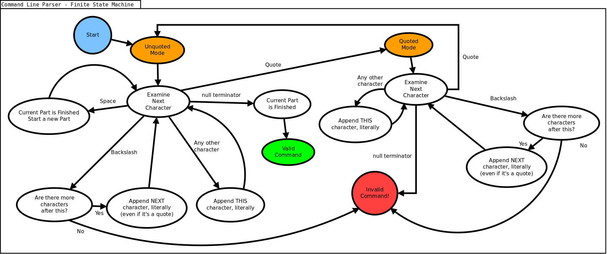

# Command Line Interpreter

Write a C/C++ program to implement an interactive shell in which users can execute commands.

## Operating System

Your program must work with our chosen Linux environment this semester. You do not need to make your program cross-compatible with Windows.

## Source Code Files

You will need to modify/implement several source code files to complete this assignment. Mostly, you'll need to implement the ```Executor``` and ```Parser``` classes, which each have respectively named *hpp* and *cpp* files. You'll also need to implement some code into *main.cpp* to get your program working correctly.

You will not need to modify all source code files. In fact, modification of certain files may cause your tests to break. Inspect each source code file and look for a message at the top, which will let you know whether or not you need to implement code there.

## Basic Idea

Create an infinite loop that repeatedly prompts the user to enter a command, then executes that command on behalf of the user. The command must be compared against the following list of supported commands:

|Linux Command |
|--------------|
|ls            |
|df            |
|pwd           |
|ps            |
|gedit         |
|echo          |
|ping          |

Regardless of the command entered, your program should first print out a list of arguments in the command, parsed and by index. For example, if the user entered ```ping -c 5 192.168.1.1```, your program would output:
```console
Parts:
> [0] == ping
> [1] == -c
> [2] == 5
> [3] == 192.168.1.1
```
(more examples further down)

### Exit or Quit

If the user types ```exit``` or ```quit```, your shell should say goodbye to the user and terminate. Use the following goodbye message: *Thanks for using my interpreter. Goodbye!*

### Invalid Commands

If the user entered an invalid command, your program should complain *Invalid command!* and continue prompting the user for more commands.

### Valid Commands

If the user entered a valid command, your program should execute the command in a child thread. In other words, create a child thread that executes the command. You do not need to actually write code to execute each command. Simply pass the command into the system call function [```system()```](https://cplusplus.com/reference/cstdlib/system/) and let the operating system handle the processing for you. The parent thread then waits for the child to terminate so they can join together.

## Parsing the Command

Since some commands require more than one argument (e.g., ```echo```, ```ping```), you will need to parse the user input to separate arguments, then pass those arguments to the program being executed.

We'll try to implement the general behavior of the *bash* shell:

* When outside quotes, spaces act as argument delimiters

* When inside quotes, spaces do not act as argument delimiters

* The first argument/part is the name or path of a program to be executed

* All parts after the first are arguments sent into the program to be executed

For example, the command ```ping -c 5 192.168.1.1``` has several parts:

* ping

* -c

* 5

* 192.168.1.1

Your program would break up the parts into a vector or array, which we'll represent like this: ```{"ping", "-c", "5", "192.168.1.1}```

Since the first part above is *ping*, that is the program that will be executed. Your program would then send the following arguments into the *ping* program: ```{"-c", "5", "192.168.1.1"}```. Conveniently, this will be as simple as concatenating the parts back together into a string, with only a couple special considerations (more information further down).

Also recall that delimiters are ignored inside quotes. Look at the following command:

```shell
echo "Hello there!"
```

The command above would actually be parsed to the following: ```{"echo", "Hello there!"}```. This is because the space between *Hello* and *there* is not processed as a delimiter, because it is inside a quotation.

And of course, once we support quoting, we need to support quotes-inside-quotes. The way this is usually done is to consider anything after a backslash as a literal character, and not something that can switch modes. So if we used the following command:

```shell
echo "Hey this is a quote \" inside a quote!"
```

We would end up with ```echo``` being the first part/argument as before, but then the entire quoted part would be: ```Hey this is a quote " inside a quote!```, for a total of 2 parts.

## Rebuilding the Command

The [```system()```](https://cplusplus.com/reference/cstdlib/system/) function does not actually receive a vector of ```std::string``` objects. Instead, it needs one single instance of a ```const char *```, which means you'll need to rebuild the command after parsing to parts. You'll start with the ```std::vector<std::string>``` containing each part/argument, and convert it to a single ```const char *```. You can accomplish this in a few steps:

* Start with an empty ```std::string```.

* Loop over the vector to iterate over each part.

* Add each character in the current part to the ```std::string```.

* Make sure to add a backslash before any special character. In our case, our only special characters are:

    1. quote
    2. backslash

* Make sure to add spaces between arguments.

* After building the string, you can get a ```const char *``` by simply calling [```std::string::c_str```](https://www.cplusplus.com/reference/string/string/c_str/).

## Extra Hints and Tricks

This section will contain extra hints and tips to help you along your way.

### Compilation and Execution

You may develop in any editor you wish, but you should only compile your program using [GNU Make](https://www.gnu.org/software/make/). Simply open a terminal at the root of your repository, and execute the following command: ```make run```. You can also get a quick estimate of your grade with ```make test```, or see other options with ```make help```:
```console
mike@station3:solution$ make help
Assignment 2 - Makefile Menu

make build   ==> Build the program
make run     ==> Run the program
make debug   ==> Debug the program with gdb

make test    ==> Test your program

make clean   ==> Remove object files, the main executables, and other temporary files
```

### Receiving Input

You can receive input from your user in a variety of ways. The easiest is probably to just use [```cin.getline```](https://www.cplusplus.com/reference/istream/istream/getline/) with a large buffer (e.g., 8192 bytes). The more common ```cin >> variable``` method will probably break up the input in bad ways.

### Using a Class Method as the Callback With pthread_create

Most examples involving ```pthread_create``` are written in C (because ```pthread_create``` is a C function), thus only show how to use global functions as callbacks. How do you tell ```pthread_create``` to use a class method as the callback? The answer is to make the method static, and use its namespace.

Suppose we'd like to use the method ```threadRunner```, which is inside our ```Executor``` class. First we should ensure the method is static in the declaration:
```cpp
static void* threadRunner(void* param);
```
After that, we can simply pass the name of the method, accessed via the ```Executor``` namespace, like so:
```cpp
pthread_create(TODO, TODO, Executor::threadRunner, TODO);
```

### Callback signature for pthread_create

You will notice that the ```pthread_create``` function takes in a callback function of any name, but a specific signature:

```void* myFunction(void* params);```

This means, of course, that the callback function you use to launch your threads needs to have a matching signature. No matter what data you pass into the ```params``` argument, it will show up as a ```void*``` inside your callback. So how do you use that? The answer is [static casting](https://en.cppreference.com/w/cpp/language/static_cast).

Here's an example for how you'd use the ```param``` argument as a ```char *```:
```cpp
void* myCallback(void* param)
{
	char* command = static_cast<char*>(param);
	std::cout << "The command is: " << command << std::endl;
}
```

Here's another example showing how you might pass a full object, such as a ```std::vector<std::string>```. All you'd need to do first is to pass a pointer to the object when calling ```pthread_create```:
```cpp
void* myCallback(void* param)
{
	std::vector<std::string>* parts = static_cast<std::vector<std::string>*>(param);
	std::cout << "Size of my vector is: " << parts->size() << std::endl;
}
```

From there, you can work with the vector, keeping in mind it is a pointer. Notice in the above example, vector methods are accessed with the ```->``` operator.

### Finite State Machines

You may find the following images of Finite State Machines helpful. They are not perfect, but will hopefully inspire you.

These refer to parsing the command line, with support for quoting and escaping. Each Finite State Machine is one possible way to think about the same idea.



")

## Sample Output

Sample output and input are shown below.

```console
Welcome to my command line interpreter (aka shell)
Written by Niles Peppertrout.

Enter next command
==> weiufhewifuh
Parts:
> [0] == weiufhewifuh
Invalid command!
(Unknown program)

Enter next command
==> ls
Parts:
> [0] == ls
images	INSTRUCTIONS.md  main  main.cpp  main.o  Makefile  Parser.cpp  Parser-FSM.dia  Parser-FSM-Vars.dia  Parser.hpp	Parser.o

Enter next command
==> ls -l -a
Parts:
> [0] == ls
> [1] == -l
> [2] == -a
total 752
drwxrwxr-x 3 mike mike   4096 Mar  4 18:07 .
drwxrwxr-x 4 mike mike   4096 Mar  4 05:12 ..
-rw-rw-r-- 1 mike mike    103 Mar  4 05:12 .git
-rw-rw-r-- 1 mike mike     13 Mar  4 05:12 .gitignore
drwxrwxr-x 2 mike mike   4096 Mar  4 16:41 images
-rw-rw-r-- 1 mike mike   7111 Mar  4 18:03 INSTRUCTIONS.md
-rwxrwxr-x 1 mike mike 225512 Mar  4 18:07 main
-rw-rw-r-- 1 mike mike   2538 Mar  4 18:01 main.cpp
-rw-rw-r-- 1 mike mike 248584 Mar  4 18:07 main.o
-rw-rw-r-- 1 mike mike    968 Mar  4 17:35 Makefile
-rw-rw-r-- 1 mike mike   2214 Mar  4 18:07 Parser.cpp
-rw-rw-r-- 1 mike mike   4950 Mar  4 07:01 Parser-FSM.dia
-rw-rw-r-- 1 mike mike   4172 Mar  4 16:51 Parser-FSM-Vars.dia
-rw-rw-r-- 1 mike mike    616 Mar  4 17:52 Parser.hpp
-rw-rw-r-- 1 mike mike 227312 Mar  4 18:07 Parser.o

Enter next command
==> ping -c 5 192.168.1.1
Parts:
> [0] == ping
> [1] == -c
> [2] == 5
> [3] == 192.168.1.1
PING 192.168.1.1 (192.168.1.1) 56(84) bytes of data.
64 bytes from 192.168.1.1: icmp_seq=1 ttl=64 time=0.292 ms
64 bytes from 192.168.1.1: icmp_seq=2 ttl=64 time=0.352 ms
64 bytes from 192.168.1.1: icmp_seq=3 ttl=64 time=0.285 ms
64 bytes from 192.168.1.1: icmp_seq=4 ttl=64 time=0.317 ms
64 bytes from 192.168.1.1: icmp_seq=5 ttl=64 time=0.375 ms

--- 192.168.1.1 ping statistics ---
5 packets transmitted, 5 received, 0% packet loss, time 4094ms
rtt min/avg/max/mdev = 0.285/0.324/0.375/0.034 ms

Enter next command
==> echo Hello
Parts:
> [0] == echo
> [1] == Hello
Hello

Enter next command
==> echo "Hello"
Parts:
> [0] == echo
> [1] == Hello
Hello

Enter next command
==> echo Hello there
Parts:
> [0] == echo
> [1] == Hello
> [2] == there
Hello there

Enter next command
==> echo "Hello there"
Parts:
> [0] == echo
> [1] == Hello there
Hello there

Enter next command
==> echo "Hello \" there"
Parts:
> [0] == echo
> [1] == Hello " there
Hello " there

Enter next command
==> echo "Hello \" \\ there"
Parts:
> [0] == echo
> [1] == Hello " \ there
Hello " \ there

Enter next command
==> echo "Hello there
Invalid command!
(Found null terminator while in quote or escape mode)

Enter next command
==> exit
Parts:
> [0] == exit
Thanks for using my interpreter. Goodbye!
```

## Submission

Submit your program by pushing to Github regularly as you work, and submitting to Gradescope whenever you wish to check your grade. You may submit to Gradescope as often as you wish.

Please note that auto-grading is always subject to manual review. If you get a perfect score from the auto-grader, but have somehow subverted the intention of this assignment, you'll probably end up with a very poor score, or a zero.

## Copyright and Acknowledgment

Copyright 2022, Mike Peralta.

This assignment prompt was inspired by a prompt found {? somewhere ?}.

This prompt and starter code are licensed via: [Creative Commons; Attribution-ShareAlike 4.0 International (CC BY-SA 4.0)](https://creativecommons.org/licenses/by-sa/4.0/).


